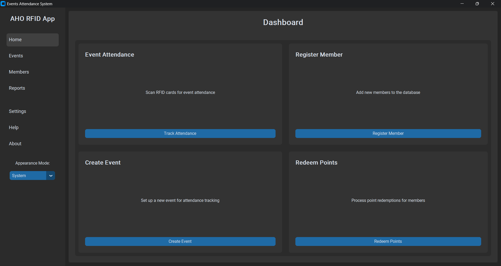

# Ev_Ap

**Ev_Ap or Event Attendance** is an application designed for managing event attendance. It allows users to register members, track attendance at events, and manage event-related data efficiently.

## Features

- **Member Registration:** Register members with their Unique ID Num, ID, name, program, and year.
- **Event Management:** Create new events and track member attendance for each event.
- **Attendance Tracking:** Scan or Type Unique ID Num to mark attendance for members at events.
- **Data Export:** Export attendance data to CSV or Excel for further analysis.

## Requirements

- Python 3.x
- SQLite (automatically handled by the application)
- CustomTkinter (for the UI)
- IceCream (for debugging)
- pandas (for exporting data)

## Installation

1. Clone this repository:
    ```bash
    git clone https://github.com/TriangleBear/Ev_Ap
    ```

2. Navigate to the project directory:
    ```bash
    cd Ev_Ap
    ```

3. Install the required Python libraries:
    ```bash
    pip install -r requirements.txt
    ```

4. Run the application:
    ```bash
    python main.py
    ```

## Usage

### Registering a Member

1. Open the "Register Member" window from the main menu.
2. Fill in the member's details (Unique ID Num, name, student number, program, year).
3. Click the "Submit" button to register the member.

### Creating an Event

1. Open the "Create Event" window.
2. Enter a name for the new event.
3. Click "Submit" to create the event and start tracking attendance.

### Marking Attendance

1. Select an event from the "Select a table" dropdown menu.
2. Scan or Type the Unique ID Num of a registered member to mark their attendance at the event.

### Exporting Data

1. After viewing the event's attendance data, click "Export" to save the data as a CSV or Excel file.

## Screenshots



## Contributing

We welcome contributions! If you would like to help improve the Event Attendance app, follow these steps:

1. Fork the repository.
2. Create a new branch for your feature or bug fix.
3. Make your changes.
4. Test your changes thoroughly.
5. Submit a pull request describing your changes.

## License

This project is licensed under the MIT License - see the [LICENSE](LICENSE) file for details.
